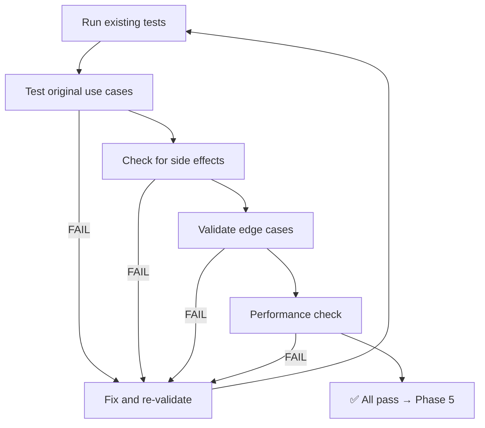
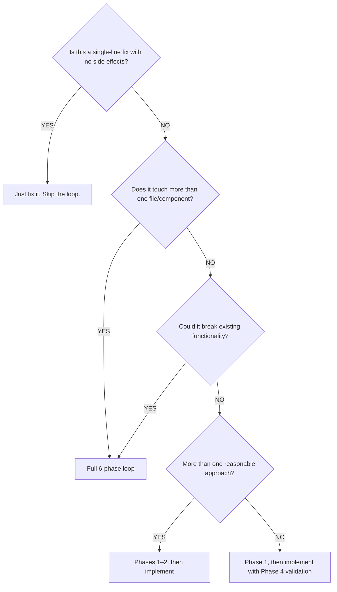

# Planning and Development

A structured, phase-based problem-solving loop for all development tasks. Ensures every change is analyzed, designed with options, implemented correctly, validated for regressions, optimized for best practices, and documented — before being considered complete.

**Core principle:** Never jump straight to code. Analyze first, design with options, implement deliberately, validate thoroughly, optimize for quality, and document for posterity.

---

## When to Use

- Planning a new feature or component
- Refactoring existing code without breaking functionality
- Debugging a complex or multi-layered issue
- Executing any multi-step development task
- Making architectural decisions that affect multiple files
- Any task where "just start coding" would be risky

### When NOT to Use

- Trivial one-line fixes (typos, formatting, simple renames)
- Tasks with a single obvious solution and no risk of regression
- Pure documentation or comment-only changes

---

## The 6-Phase Development Loop

| Phase | Task | Methodology | Deliverable |
| --- | --- | --- | --- |
| **1. Problem Analysis** | Define the problem & constraints | Identify pain points, review current code structure, gather requirements | Clear, documented problem statement |
| **2. Solution Design** | Brainstorm multiple solution options | Propose 3+ approaches, compare trade-offs (complexity, reusability, performance) | Shortlisted solutions (1–2 best options) |
| **3. Implementation** | Develop the selected solution | Use framework patterns, ensure type safety & accessibility | Working code + tests |
| **4. Validation** | Regression testing & error handling | Test all original use cases, check for side effects, validate edge cases | Fixed issues, documented regressions |
| **5. Optimization** | Refine for best practices | Lint, type-check, performance review, simplify logic | Optimized, maintainable solution |
| **6. Documentation** | Finalize with clear usage guidelines | Write docs, add examples, update changelog (if requested, and change is related to app) | Clean code + documentation updates |

---

## Phase 1: Problem Analysis

**Goal:** Understand the problem completely before proposing any solution.

### Checklist

- [ ] **Define the problem** — What is broken, missing, or suboptimal?
- [ ] **Identify constraints** — Performance, compatibility, time, dependencies?
- [ ] **Review current code** — Read the relevant files, understand the data flow
- [ ] **Gather requirements** — What does "done" look like? What must be preserved?
- [ ] **Document the problem statement** — Write it down clearly before continuing

### Key Questions

1. What exactly is the current behavior?
2. What is the desired behavior?
3. What constraints limit the solution space?
4. What existing functionality must NOT break?
5. Are there related areas of the codebase that could be affected?

### Anti-Patterns

| Bad Practice | Better Approach |
| --- | --- |
| Skipping analysis and jumping to code | Spend 10–15% of task time on analysis |
| Assuming you understand the problem from the title alone | Read the code, trace the data flow, reproduce the issue |
| Ignoring constraints until implementation | Surface constraints early — they eliminate bad options |

---

## Phase 2: Solution Design

**Goal:** Generate multiple options, compare trade-offs, and select the best approach.

### The 3-Option Rule

Always propose at least 3 solution approaches before selecting one. This prevents anchoring on the first idea and surfaces better alternatives.

### Option Evaluation Template

For each option, evaluate:

```text
Option [A/B/C]: [Short description]
  Approach:    [How it works]
  Pros:        [Benefits — performance, readability, reusability]
  Cons:        [Drawbacks — complexity, risk, maintenance burden]
  Risk:        [Low/Medium/High — what could go wrong?]
  Effort:      [Low/Medium/High — how long will it take?]
```

### Decision Criteria

Rank options using these weighted factors:

1. **Correctness** — Does it fully solve the problem?
2. **Regression risk** — How likely is it to break existing functionality?
3. **Maintainability** — Will future developers understand this?
4. **Performance** — Is it efficient for the expected data/load?
5. **Reusability** — Can this pattern be used elsewhere?
6. **Effort** — Is the implementation cost justified?

### Anti-Patterns

| Bad Practice | Better Approach |
| --- | --- |
| Proposing only one solution | Always generate 3+ options to avoid tunnel vision |
| Choosing the most complex solution | Prefer simplicity unless complexity is justified |
| Ignoring trade-offs | Every option has cons — document them honestly |
| Over-engineering for hypothetical future needs | Solve today's problem; design for extension, not prediction |

---

## Phase 3: Implementation

**Goal:** Build the selected solution using best practices, focused and incremental changes.

### Implementation Principles

1. **One change at a time** — Make small, focused commits. Don't mix refactoring with feature work.
2. **Follow established patterns** — Match the codebase's existing conventions
3. **Type everything** — No `any` types, no implicit return types on public APIs
4. **Comment the "why"** — Code shows *what*; comments explain *why*
5. **Preserve existing behavior** — Don't refactor "while you're in there" unless it's the task

### Implementation Checklist

- [ ] Create/modify files according to the selected design
- [ ] Follow the project's code conventions and patterns
- [ ] Add proper TypeScript types and interfaces
- [ ] Ensure accessibility (ARIA labels, keyboard navigation, semantic HTML)
- [ ] Handle error cases and edge conditions
- [ ] Add inline comments explaining non-obvious logic

### Anti-Patterns

| Bad Practice | Better Approach |
| --- | --- |
| Changing everything at once | Small, incremental changes that can be validated independently |
| Using hacks or workarounds | Implement the correct solution, even if it takes longer |
| Ignoring error handling | Every external call, user input, and state transition needs error handling |
| Hard-coding values | Use constants, config, or environment variables |
| Placeholder implementations | Never leave `// TODO` or stub code in a "completed" task |

---

## Phase 4: Validation

**Goal:** Verify the implementation works correctly and hasn't introduced regressions.

### Validation Loop



### Validation Checklist

- [ ] **Existing tests pass** — Run the full test suite
- [ ] **Original functionality preserved** — Test every pre-existing use case
- [ ] **New functionality works** — Test the new behavior thoroughly
- [ ] **Edge cases handled** — Empty inputs, null values, boundary conditions
- [ ] **Error states handled** — Invalid data, network failures, permission issues
- [ ] **No unintended side effects** — Check related features and components
- [ ] **Performance acceptable** — No introduced memory leaks, unnecessary re-renders, or slow operations

### Regression Detection

When validating refactored code, compare:

1. **Visual output** — Does it render identically? (visual diff if applicable)
2. **Data flow** — Do props, state, and events still work?
3. **API contracts** — Are public interfaces unchanged?
4. **Error behavior** — Do errors still surface correctly?

### Anti-Patterns

| Bad Practice | Better Approach |
| --- | --- |
| "It compiles, ship it" | Run tests, test manually, validate edge cases |
| Only testing the happy path | Test failure modes, edge cases, and empty states |
| Skipping validation "because it's a small change" | Small changes can have large side effects |
| Not re-reading your own code after writing it | Review your diff before marking a task complete |

---

## Phase 5: Optimization

**Goal:** Refine the code for quality, performance, and maintainability.

### Optimization Checklist

- [ ] **Lint clean** — No warnings, no suppressed rules without justification
- [ ] **Type-safe** — No `any`, no `@ts-ignore` without justification
- [ ] **Performance reviewed** — `React.memo` where appropriate, no unnecessary re-renders, efficient data structures
- [ ] **Logic simplified** — Can any code be merged, extracted, or removed?
- [ ] **Dead code removed** — No commented-out code, no unused imports
- [ ] **Best practices applied** — Framework-specific patterns, accessibility, security

### Performance Considerations

| Area | Check |
| --- | --- |
| Re-renders | Are components re-rendering unnecessarily? Use `React.memo`, `useMemo`, `useCallback` where measured impact exists |
| Data fetching | Is data cached appropriately? Are requests deduplicated? |
| Bundle size | Are large dependencies imported correctly (tree-shaking)? |
| Memory | Are event listeners and subscriptions cleaned up? |
| Debouncing | Are high-frequency operations debounced/throttled? |

### Anti-Patterns

| Bad Practice | Better Approach |
| --- | --- |
| Premature optimization | Optimize only what you've measured to be slow |
| Over-memoizing everything | `useMemo` / `useCallback` have costs — use when impact is measured |
| Ignoring linter warnings | Every warning is a potential bug. Fix or justify suppression |

---

## Phase 6: Documentation

**Goal:** Ensure the change is understandable and maintainable by others.

### Documentation Checklist

- [ ] **Code comments** — Non-obvious logic is explained inline
- [ ] **Props/API documented** — Public interfaces have clear descriptions
- [ ] **Usage examples** — Complex components have usage examples
- [ ] **Changelog updated** — Changes are recorded per project conventions (if requested, and change is related to app)
- [ ] **README updated** — If the change affects setup, usage, or architecture (if requested, and change is related to app)
- [ ] **In-app help text** — If the change affects user-visible behavior

### Anti-Patterns

| Bad Practice | Better Approach |
| --- | --- |
| No documentation at all | At minimum: inline comments + changelog entry |
| Documenting *what* the code does | Document *why* — the code already shows *what* |
| Stale documentation | Update docs in the same commit as code changes |

---

## Decision Flowchart: How Complex Is This Task?

Use this to decide how rigorously to apply the loop:



---

## Quick Reference: Phase Summaries

| Phase | One-Line Summary | Time Budget |
| --- | --- | --- |
| 1. Analysis | Understand before you act | 10–15% |
| 2. Design | Options before opinions | 15–20% |
| 3. Implementation | Small, correct, incremental | 30–40% |
| 4. Validation | Prove it works, prove nothing broke | 15–20% |
| 5. Optimization | Clean, fast, maintainable | 5–10% |
| 6. Documentation | Future-you will thank present-you | 5–10% |

---

## Common Mistakes

| Mistake | Fix |
| --- | --- |
| Skipping problem analysis | Spend at least 10% of time understanding before coding |
| Only considering one solution | Always propose 3+ options to avoid anchoring bias |
| Making too many changes at once | One logical change per commit; don't mix concerns |
| "It works on my machine" | Test edge cases, error states, and different environments |
| Refactoring while implementing features | Separate refactoring from feature work into distinct tasks |
| Skipping validation after "small" changes | Small changes cause regressions too |
| Leaving `TODO` comments as final output | Every `TODO` is an incomplete task — finish or file it |
| Not updating docs | Documentation rot is a maintenance tax |

---

## Real-World Example: Refactoring a Modal Component

### Phase 1: Problem Analysis

**Problem:** Current `UserProfileModal` is tightly coupled to one feature. We need a reusable `<TemplatedModal />` that preserves original functionality while allowing customization.

### Phase 2: Solution Design

| Option | Approach | Pros | Cons | Selected? |
| --- | --- | --- | --- | --- |
| A: HOC | Extract shared logic into a higher-order component | Clean separation, type-safe | More boilerplate per modal | No |
| B: Context | `ModalContext` + composition API | High reusability, less prop-drilling | Overhead if context isn't needed elsewhere | No |
| C: Slots | Generic `<TemplatedModal />` with `header`, `content`, `footer` slots | Most flexible, aligns with React conventions | Requires disciplined prop management | ✅ Yes |

### Phase 3: Implementation

```tsx
// Generic reusable modal with slot-based composition
interface TemplatedModalProps {
  isOpen: boolean;
  onClose: () => void;
  header?: React.ReactNode;
  content?: React.ReactNode;
  footer?: React.ReactNode;
  className?: string;
}

export const TemplatedModal = ({
  isOpen, onClose, header, content, footer, className,
}: TemplatedModalProps) => (
  <div className={`modal ${className}`} role="dialog" aria-hidden={!isOpen}>
    {header && <div className="modal-header">{header}</div>}
    <div className="modal-content">{content}</div>
    {footer && <div className="modal-footer">{footer}</div>}
  </div>
);
```

### Phase 4: Validation

- ✅ `UserProfileModal` renders identically to original (visual diff)
- ✅ `onClose` and all props still function
- ✅ Missing `isOpen`/`onClose` edge case handled with defaults

### Phase 5: Optimization

- Added `React.memo` for shallow comparison optimization
- Added ARIA attributes for accessibility (`role="dialog"`, `aria-hidden`)
- Added JSDoc `@component` documentation

### Phase 6: Documentation

- Props documented with TypeScript interface
- Usage example added to component file
- Changelog updated with new reusable modal component (if requested, and change is related to app)
