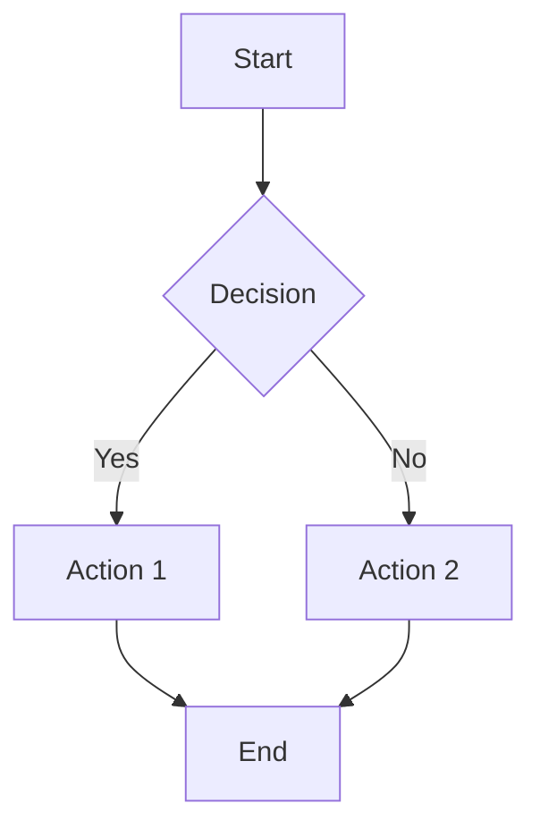

# Markdown Reference — Advanced Examples & Important Details

This file supplements the main `SKILL.md` with advanced patterns, edge cases, and detailed examples for complex Markdown constructs.

---

## Table Patterns

### Aligned Table

```markdown
| Name    | Role       | Status  |
|---------|------------|---------|
| Alice   | Developer  | Active  |
| Bob     | Designer   | Active  |
| Charlie | Manager    | On Hold |
```

### Aligned Table with Aligned Columns

```markdown
| Feature         | Support |   Price |
|:----------------|:-------:|--------:|
| Basic           |   ✅    |   Free  |
| Professional    |   ✅    | $19/mo  |
| Enterprise      |   ✅    | $99/mo  |
```

### Table with Inline Formatting

```markdown
| Method   | Description                          | Returns       |
|----------|--------------------------------------|---------------|
| `get()`  | Fetches data from the **server**     | `Promise<T>`  |
| `set()`  | Updates a _single_ record            | `boolean`     |
| `del()`  | Removes the record (see [docs][ref]) | `void`        |
```

### Wide Table with Long Content

```markdown
<!-- markdownlint-disable-next-line MD013 -->
| Parameter | Type | Default | Description |
|-----------|------|---------|-------------|
| `timeout` | `number` | `30000` | Maximum wait time in milliseconds before the operation is cancelled |
| `retries` | `number` | `3` | Number of retry attempts on failure before throwing an error |
```

### Table Edge Cases

```markdown
<!-- Escaping pipes in table cells -->
| Expression    | Result |
|---------------|--------|
| `a &#124; b`  | a or b |
| `x \| y`      | x or y |

<!-- Minimum valid table -->
| A |
| --- |
| 1 |
```

> **Warning:** Tables must have a header row and separator row. A separator with no headers is not a valid table.

---

## Nested List Structures

### Ordered List with Sub-items

```markdown
1. First major step
   1. Sub-step one
   2. Sub-step two
2. Second major step
   - Unordered sub-item
   - Another sub-item
3. Third major step
```

### List with Paragraphs

```markdown
1. First item

   This paragraph belongs to the first item. Indent continuation
   content by 3 spaces (or 1 tab) to keep it within the list item.

2. Second item

   Another paragraph continuation.
```

### List with Code Blocks

````markdown
1. Step one — install dependencies:

   ```bash
   npm install
   ```

2. Step two — start the dev server:

   ```bash
   npm run dev
   ```
````

### List with Blockquotes

```markdown
- Item with a blockquote:

  > This blockquote is nested inside a list item.
  > Indent by 2 spaces under the list marker.

- Next item
```

> **Important:** Content continuation inside list items must be indented to align with the first character of the list item's text.

---

## Complex Blockquote Patterns

### Multi-paragraph Blockquote

```markdown
> First paragraph of the quote.
>
> Second paragraph of the quote. Use `>` on blank lines
> between paragraphs to keep them inside the blockquote.
```

### Nested Blockquotes

```markdown
> Outer quote
>
>> Inner quote
>>
>>> Deeply nested quote
```

### Blockquote with Other Elements

```markdown
> ### Heading in Blockquote
>
> - List item 1
> - List item 2
>
> ```javascript
> const x = 42;
> ```
>
> Paragraph with **bold** and `code`.
```

---

## Link Patterns

### Reference-Style Links (Preferred for Long Documents)

```markdown
Read the [installation guide][install] before [configuring the app][config].

See the [FAQ][] for common questions.

<!-- Reference definitions (usually at bottom of document) -->
[install]: https://example.com/install "Installation Guide"
[config]: https://example.com/config "Configuration Reference"
[FAQ]: https://example.com/faq
```

### Heading Anchor Links

```markdown
## Installation

Instructions here...

## Usage  

See the [Installation](#installation) section first.
```

> **Important:** GitHub auto-generates anchor IDs from heading text by lowercasing, replacing spaces with hyphens, and removing special characters. Verify with MD051.

### Link Best Practices

```markdown
<!-- ✅ GOOD: Descriptive link text -->
See the [markdownlint configuration guide](https://example.com) for details.

<!-- ❌ BAD: Non-descriptive link text (MD059) -->
Click [here](https://example.com) for details.

<!-- ❌ BAD: Bare URL (MD034) -->
Visit https://example.com for more info.

<!-- ✅ GOOD: Autolink syntax -->
Visit <https://example.com> for more info.
```

---

## Code Block Patterns

### Fenced Code with Language

````markdown
```typescript
interface Config {
  name: string;
  version: number;
}
```
````

### Nested Fenced Blocks (Using 4 Backticks)

`````markdown
````markdown
Here is an example of a code block inside a code block:

```javascript
console.log("hello");
```
````
`````

> **Tip:** To nest fenced code blocks, use a higher number of backticks (or tildes) for the outer fence than the inner one. Four backticks for outer, three for inner.

### Showing Markdown Source in Code Blocks

````markdown
```markdown
# This heading is displayed as code
**Not rendered as bold** — shown as source
```
````

### Diff Blocks

````markdown
```diff
- const oldFunction = () => {};
+ const newFunction = () => {};
  const unchanged = true;
```
````

---

## Front Matter Patterns

### YAML Front Matter

```markdown
---
title: "My Document"
author: "Jane Doe"
date: 2026-01-15
tags:
  - markdown
  - documentation
---

# Document starts here
```

### TOML Front Matter

```markdown
+++
title = "My Document"
date = 2026-01-15
+++
```

> **Note:** Front matter must appear at the very start of the file. Most linters ignore it. If using MD041 (first-line-h1), front matter is handled gracefully.

---

## GitHub-Specific Extensions

### Alerts (Admonitions)

```markdown
> [!NOTE]
> Useful information the reader should know.

> [!TIP]
> Helpful advice for best results.

> [!IMPORTANT]
> Key information necessary for success.

> [!WARNING]
> Potential issues that need attention.

> [!CAUTION]
> Negative consequences of an action.
```

### Mermaid Diagrams

````markdown

````

### Math (LaTeX)

```markdown
Inline: $E = mc^2$

Block:
$$
\sum_{i=1}^{n} x_i = x_1 + x_2 + \cdots + x_n
$$
```

### Collapsed Sections

```markdown
<details>
<summary>Click to expand</summary>

This content is hidden by default.

- Item 1
- Item 2

```python
print("Hidden code")
```

</details>
```

---

## Whitespace Rules — Critical Details

### Trailing Spaces (MD009)

```markdown
<!-- ❌ BAD: Invisible trailing spaces -->
This line has trailing spaces···

<!-- ✅ GOOD: Clean line endings -->
This line has no trailing spaces
```

> **Note:** The only exception is two trailing spaces for a line break, but `<br>` is preferred.

### Multiple Blank Lines (MD012)

```markdown
<!-- ❌ BAD -->
First paragraph


Second paragraph (two blank lines above)

<!-- ✅ GOOD -->
First paragraph

Second paragraph (one blank line above)
```

### Blank Lines Around Elements (MD022, MD031, MD032, MD058)

````markdown
<!-- ✅ GOOD: Blank lines around all block elements -->
Some text.

## Heading

Some text.

- List item 1
- List item 2

More text.

```code
block
```

More text.

| Col 1 | Col 2 |
|-------|-------|
| A     | B     |

More text.
````

---

## Emphasis Edge Cases

### Mid-Word Emphasis

```markdown
<!-- Asterisks work mid-word, underscores may not -->
un*frigging*believable    ✅ Works
un_frigging_believable    ❌ May not work in all parsers
```

### Emphasis vs. List Markers

```markdown
<!-- These are NOT emphasis — they're list items -->
* Item 1
* Item 2

<!-- This IS emphasis -->
This is *italic* text.
```

### Nested Emphasis

```markdown
***Bold and italic***
**Bold with *italic* inside**
*Italic with **bold** inside*
```

---

## Escaping & Special Characters

### Characters That Need Escaping

| Character | Escaped |     Use Case        |
|-----------|---------|---------------------|
| `\`       | `\\`    | Literal backslash   |
| `` ` ``   | `` \` ``| Literal backtick    |
| `*`       | `\*`    | Literal asterisk    |
| `_`       | `\_`    | Literal underscore  |
| `{}`      | `\{ \}` | Literal braces      |
| `[]`      | `\[ \]` | Literal brackets    |
| `()`      | `\( \)` | Literal parens      |
| `#`       | `\#`    | Literal hash        |
| `+`       | `\+`    | Literal plus        |
| `-`       | `\-`    | Literal dash        |
| `.`       | `\.`    | Literal period      |
| `!`       | `\!`    | Literal exclamation |
| `\|`      | `\\\|`  | Literal pipe        |

### HTML Entities in Tables

```markdown
| Symbol | Entity     | Renders |
|--------|------------|---------|
| Pipe   | `&#124;`   | &#124;  |
| Less   | `&lt;`     | &lt;    |
| Greater| `&gt;`     | &gt;    |
| Amp    | `&amp;`    | &amp;   |
```

---

## Document Structure Template

```markdown
---
title: "Document Title"
---

# Document Title

Brief introduction paragraph.

## Section One

Content with [links](https://example.com) and **emphasis**.

### Subsection

- Bullet point one
- Bullet point two

## Section Two

| Header 1 | Header 2 |
|----------|----------|
| Cell 1   | Cell 2   |

## References

- [Source 1](https://example.com)
- [Source 2](https://example.com)
```

> **Key structural rules:**
>
> - One `#` (H1) per document (MD025)
> - Headings increment by one level (MD001) — don't jump from `##` to `####`
> - First line should be a top-level heading (MD041) unless front matter is present
> - End file with a single newline (MD047)

---

## Performance Tips for Large Documents

1. **Use reference-style links** — keeps text readable, definitions at bottom
2. **Avoid inline HTML** — pure Markdown renders faster and is more portable
3. **Keep tables simple** — complex tables with many columns are hard to maintain; consider splitting
4. **Use heading anchors** — enable in-document navigation with `[text](#heading-id)`
5. **Organize with horizontal rules** — `---` between major sections adds visual separation

---

## Quick Troubleshooting

| Problem | Likely Cause | Fix |
| --------- | ------------- | ----- |
| List not rendering | Missing blank line before list | Add blank line (MD032) |
| Table not rendering | Missing header separator row | Add `\|---\|---\|` row |
| Code block not closing | Mismatched fence markers | Match backtick/tilde count |
| Emphasis not rendering | Spaces inside markers | Remove spaces: `*text*` not `* text *` (MD037) |
| Link not rendering | Reversed syntax | Use `[text](url)` not `(text)[url]` (MD011) |
| Heading not rendering | Missing space after `#` | Add space: `# Heading` not `#Heading` (MD018) |
| Image not rendering | Missing alt text bracket | Use `` not `[alt](url)` |
